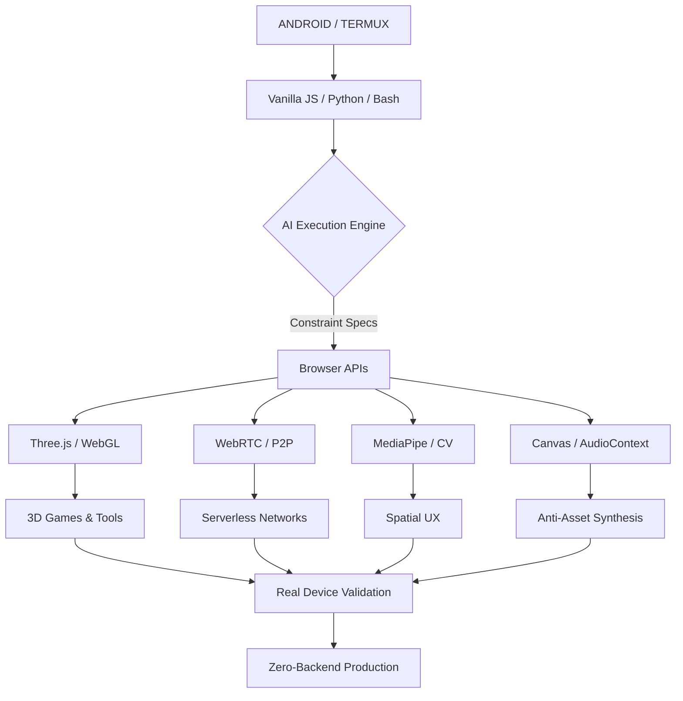
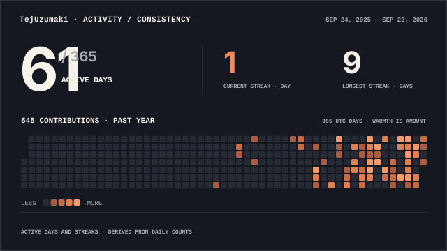
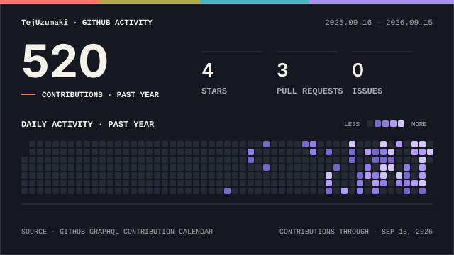

<p align="center">
  <a href="https://github.com/TejUzumaki">
    
  </a>
</p>

<p align="center">
  <sub>RUNTIME: ANDROID / TERMUX</sub> &nbsp;•&nbsp; <sub>ENGINE: VANILLA JS / PYTHON</sub> &nbsp;•&nbsp; <sub>NETWORK: P2P / WEBRTC</sub>
</p>

<p align="center">
  <a href="https://github.com/TejUzumaki">
    
  </a>
  &nbsp;
  <a href="https://github.com/TejUzumaki?tab=followers">
    
  </a>
  &nbsp;
  <a href="https://github.com/TejUzumaki?tab=repositories">
    
  </a>
</p>

<p align="center">
  I build production-minded software systems entirely from an Android tablet. No high-end PC, no heavy IDEs—just Termux, raw browser APIs, and AI as my execution engine. I provide exhaustive, constraint-heavy specifications to build systems that span 3D graphics, decentralized networking, and behavioral UX.
</p>

---

## 🧠 `whoami`

```python
class Tejas:

    role = "Mobile-First Systems Architect"

    focus = [
        "Zero-Backend P2P Networking",
        "3D Graphics & Custom GLSL Shaders",
        "Computer Vision (MediaPipe)",
        "Behavioral UX & Digital Wellbeing",
        "AI-Assisted Execution Pipelines"
    ]

    philosophy = "Anti-Asset Engineering: Synthesize, never import."
```

---

## ⚡ NOW

```text
BUILDING
├── DirectDrop P2P (Hybrid Native Kotlin)
├── Brainrot Adventure (Open-world FPS)
└── HoloDrive Rally (Hand-tracked Racing)

EXPLORING
├── Native Android bridges
├── WebRTC architectures
├── GPU/WebGL pipelines
└── AI-assisted development

CONSTRAINT
└── Android-first development
```

---

# 🏆 ACHIEVEMENTS

<div align="center">

### 🥇 CUSTOM SOFTWARE 3D RENDERER

**Built Without WebGL**

Architected a custom `project(x, y, z, cam)` function calculating FOV, yaw, and pitch manually, and implemented the Painter's algorithm for depth-sorting in both Python (Tkinter) and JS (Canvas API).

<br>

### 🏆 CONSTRAINT-DRIVEN ENGINEERING

**Compact Data Representations**

Designed compact data representations and reusable geometry helpers to reduce memory, source size, and implementation complexity when building graphics systems on constrained hardware.

<br>

### 📜 PEER-TO-PEER NETWORKING

**Decentralized Discovery**

Invented a "Local Outbox" state machine simulating backend message queuing via `localStorage`, and implemented a pure WebRTC Gossip Protocol for 1-hop manifest relays without a central server.

</div>

<br>

<div align="center">


</div>

---

### ⚙️ Engineering Principles

> **01 // ANTI-ASSET ENGINEERING**
> I don't rely on external `.mp3`s, `.png`s, or heavy frameworks. I synthesize audio via Web Audio API oscillators, generate textures via SVG `feTurbulence`, and write custom DOM engines to maintain strict single-file, offline-first architectures.
>
> **02 // CONSTRAINT-DRIVEN ENGINEERING**
> I design compact data representations and reusable geometry helpers to reduce memory, source size, and implementation complexity when building graphics systems on constrained hardware.
>
> **03 // FRICTION CHOREOGRAPHY**
> I design UX at the millisecond level. From staggered `setTimeout` sequences that force users to sit with their achievements, to pausing CSS animations during mobile drag-events to prevent UI clipping.
>
> **04 // NO FAKE DATA POLICY**
> When APIs fail (CORS, etc.), I build "honest-state" fallbacks. I never mock data for a demo. If it's not real, it's explicitly marked as integration-pending.

---

# 🚀 WHAT I BUILD

<table>
<tr>
<td width="50%">

### 🛰️ SYSTEMS & NETWORKING

- WebRTC / PeerJS P2P Architecture
- Serverless Vercel Functions
- Local-First State Management
- Native OS Bridge (Kotlin)
- API Protocol Reverse-Engineering
- Honest-State Fallbacks

</td>

<td width="50%">

### ⚙️ GRAPHICS & SPATIAL UX

- Three.js / WebGL Engine Tuning
- Custom GLSL Shader Programming
- MediaPipe Hand Tracking (21-pt)
- Canvas 2D Pixel Manipulation
- Software Rendering (No GPU)
- Touch Event Engineering

</td>
</tr>
</table>

---

# 🔥 FEATURED PROJECTS

## 🧠 DIRECTDROP P2P

`Kotlin` `WebRTC` `PWA` `Vanilla JS`

> **A 100% client-side, serverless tactical communication tool.**

### What makes it interesting?

- ✨ Hybrid Native Architecture: Kotlin `DirectDropForegroundService` injected via WebView Javascript Interface for true background ringing.
- ⚡ Split-Storage System: Text in `localStorage`, heavy media in `IndexedDB`.
- 🔐 Secure Matchmaking: 6-character alphanumeric room codes to prevent brute-forcing.
- 🧠 Local Outbox: Queues messages locally and auto-retries every 15s.

### Tech used

`Kotlin` · `WebRTC` · `PeerJS` · `IndexedDB` · `Vercel`

<br>

<div align="center">

<a href="https://github.com/TejUzumaki?tab=repositories">

</a>

</div>

---

## 🚀 BRAINROT ADVENTURE

`Three.js` `GLSL` `Web Audio API` `ES6 Modules`

> **A mobile-first open-world FPS survival game.**

### Highlights

- 🔥 Attacker-side hit detection to prevent P2P network desync.
- ⚡ 9-sphere body-accurate hitboxes for precise combat.
- 🧠 Chunk-streaming terrain system (load/unload based on player position).
- 🛡️ Fully procedural Web Audio sound engine (zero external `.mp3` files).

<div align="center">

<a href="https://github.com/TejUzumaki?tab=repositories">

</a>

</div>

---

## ⚙️ DIGITAL RESET

`Vanilla JS` `CSS3` `PWA` `Service Workers`

> **A digital wellbeing PWA enforcing anti-dopamine UX.**

```text
                    USER INPUT
                         │
                         ▼
                 ┌───────────────┐
                 │   COMMIT      │
                 └───────┬───────┘
                         │
                         ▼
                 ┌───────────────┐
                 │   LOCK STATE  │ (Timestamped)
                 └───────┬───────┘
                         │
                         ▼
                 ┌───────────────┐
                 │   PROOF       │ (Image Upload)
                 └───────┬───────┘
                         │
                         ▼
                 ┌───────────────┐
                 │   ROUTER      │ (Locked)
                 └───────┬───────┘
                         │
                         ▼
                 ┌───────────────┐
                 │   REWARD      │ (Staggered UX)
                 └───────────────┘
```

<div align="center">

<a href="https://github.com/TejUzumaki?tab=repositories">

</a>

</div>

---

# 🧩 TECH STACK

<div align="center">

### ⚙️ LANGUAGES & RUNTIME


### 🌐 GRAPHICS & VISION


### ☁️ INFRASTRUCTURE


</div>

---

### 🗺️ System Architecture



### 🧮 Algorithmic Proofs

<details>
<summary><b>View Mathematical Implementations</b></summary>
<br>

**HoloDrive Rally — Steering Projection (MediaPipe Signal Processing)**
```math
\theta = \operatorname{atan2}(y_2-y_1, x_2-x_1)
```
*Implemented with hysteresis deadzones (`STEER_ENGAGE_DEADZONE` vs `STEER_RELEASE_DEADZONE`) and a progressive response curve (`Math.pow(normalized, 1.7)`) to filter tracking noise.*

**AgroTech AI — Smart Sell Assistant (Geospatial Distance)**
```math
a = \sin^2\left(\frac{\Delta\varphi}{2}\right) + \cos(\varphi_1)\cos(\varphi_2)\sin^2\left(\frac{\Delta\lambda}{2}\right)
```
*Calculates distance between user geolocation and target mandis to compute transport costs vs. higher market prices.*

</details>

---

# 🔬 HOW I APPROACH ENGINEERING

```text
                 ┌─────────────────────┐
                 │   HARDWARE LIMIT     │ (Android Tablet)
                 └──────────┬──────────┘
                            │
                            ▼
                 ┌─────────────────────┐
                 │   CONSTRAINT SPEC   │
                 │ (Exhaustive Rules)  │
                 └──────────┬──────────┘
                            │
                            ▼
                 ┌─────────────────────┐
                 │    AI EXECUTION     │
                 │ (Context-Window Hack)│
                 └──────────┬──────────┘
                            │
                            ▼
                 ┌─────────────────────┐
                 │  RUTHLESS QA / DEBUG│
                 │ (Root-Cause Tracing)│
                 └──────────┬──────────┘
                            │
                            ▼
                 ┌─────────────────────┐
                 │     ZERO-BACKEND    │
                 │ (Vercel / P2P / PWA)│
                 └─────────────────────┘
```

---

<!-- Telemetry assets are generated by GitHub Actions into ./profile/
     and committed to this repository — no third-party rendering service
     is queried at view time. See the Asset Pipeline section below. -->

# 📊 GITHUB INTELLIGENCE

<div align="center">




<br>
<br>

<picture>
  <source media="(prefers-color-scheme: dark)" srcset="./profile/activity-consistency-wide-dark.svg">
  <source media="(prefers-color-scheme: light)" srcset="./profile/activity-consistency-wide-light.svg">
  
</picture>

</div>

---

# 🐍 CONTRIBUTION MATRIX

<div align="center">

<picture>
  <source media="(prefers-color-scheme: dark)" srcset="./profile/github-snake-dark.svg" />
  <source media="(prefers-color-scheme: light)" srcset="./profile/github-snake.svg" />
  
</picture>

</div>

---

# 📈 ACTIVITY

<div align="center">

<picture>
  <source media="(prefers-color-scheme: dark)" srcset="./profile/signal-field-wide-dark.svg">
  <source media="(prefers-color-scheme: light)" srcset="./profile/signal-field-wide-light.svg">
  
</picture>

</div>

---

### ⚙️ Asset Pipeline

<details>
<summary><b>How this telemetry is generated (Zero-Runtime Dependencies)</b></summary>
<br>

All statistics above are **static SVGs generated by scheduled GitHub Actions** and committed directly into this repository. Nothing is rendered by a third-party server when you load this profile.

| Asset | Generator | Schedule |
| :--- | :--- | :--- |
| `profile/stats.svg` | [github-readme-stats-action](https://github.com/stats-organization/github-readme-stats-action) | Nightly |
| `profile/top-langs.svg` | [github-readme-stats-action](https://github.com/stats-organization/github-readme-stats-action) | Nightly |
| `profile/activity-consistency-*.svg` | [github-profile-stats](https://github.com/shinpr/github-profile-stats) | Nightly |
| `profile/signal-field-*.svg` | [github-profile-stats](https://github.com/shinpr/github-profile-stats) | Nightly |
| `profile/language-composition-*.svg` | [github-profile-stats](https://github.com/shinpr/github-profile-stats) | Nightly |
| `profile/github-snake(-dark).svg` | [Platane/snk](https://github.com/Platane/snk) `svg-only@v3` | Nightly |
| Pipeline execution | [GitHub Actions](https://github.com/features/actions) | Scheduled + manual |

**Palette:** `bg #0a0a0b` · `signal #7CFF6B` · `accent #6b8f71` · `text #e4e4e7`

Dark/light variants served via `<picture>` + `prefers-color-scheme`.

</details>

---

# 🗄️ EXPERIMENTS / ARCHIVE

<details>
<summary><b>Expand Complete System Index</b></summary>
<br>

| System | Domain | Core Tech | State |
| :--- | :--- | :--- | :---: |
| **Portal FX** | Computer Vision | MediaPipe, Canvas API | `ACTIVE` |
| **V2H (Visual to HTML)** | Dev Tools | JSZip, html2canvas | `ACTIVE` |
| **CodeSathee** | Dev Tools | CRDT (Yjs), WebRTC | `ACTIVE` |
| **The Last Wanderer** | Game Engine | Python, Tkinter, Canvas | `EXPERIMENTAL` |
| **Boulder Smash** | Game Physics | Cannon-es, Three.js | `ACTIVE` |
| **HoloDrive Rally** | Spatial Computing | MediaPipe, Three.js, WebRTC | `ACTIVE` |
| **HOLO-MANIP** | Spatial Computing | GLSL, MediaPipe | `ACTIVE` |
| **Operation Exam Mode** | System Security | PowerShell, Crypto API | `ACTIVE` |
| **Tideborne** | Game Engine | GLSL, Perlin Noise | `ACTIVE` |
| **DeskBuddy / SAGE** | Desktop App | Python, Windows API | `ACTIVE` |
| **GrappleStrike** | Game Physics | Three.js, Touch API | `ACTIVE` |
| **MATH Advanced Learning** | EdTech | YouTube API, DOM Router | `ACTIVE` |
| **SpeakTerm** | CLI Tool | Vosk, PortAudio, eSpeak | `ACTIVE` |
| **Medieval Journal** | PWA | Vanilla JS, SVG `feTurbulence` | `ACTIVE` |

<a href="https://github.com/TejUzumaki?tab=repositories">

</a>

</details>

---

# 📫 LET'S CONNECT

<div align="center">

<a href="https://github.com/TejUzumaki">

</a>

<a href="https://github.com/TejUzumaki?tab=repositories">

</a>

</div>

<br>

<div align="center">

### ⚡ Building the future from a tablet. One single-file app at a time.

<br>


</div>
